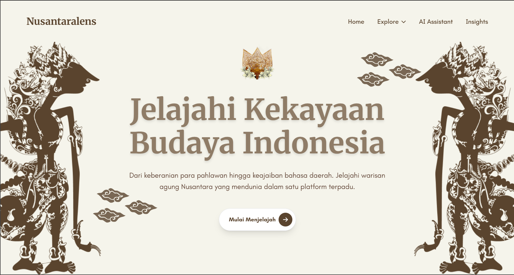

# Nusantaralens

## Tentang NusantaraLens

NusantaraLens merupakan platform digital berbasis web yang dirancang untuk membantu pengguna mengenal dan memahami keberagaman budaya Indonesia secara lebih menarik, terstruktur, dan mudah diakses.

Melalui kombinasi teknologi visualisasi data dan Artificial Intelligence (AI), NusantaraLens menyediakan berbagai informasi mengenai budaya, tradisi, bahasa daerah, pahlawan nasional, serta data statistik Indonesia dalam satu platform terintegrasi.

Proyek ini dikembangkan sebagai media edukasi digital yang mendorong pengguna untuk mengeksplorasi kekayaan Nusantara secara interaktif dan berkelanjutan.

## Tujuan Proyek

NusantaraLens dikembangkan untuk:

- Mempermudah akses terhadap informasi budaya dan sejarah Indonesia.
- Meningkatkan minat belajar masyarakat melalui media digital yang interaktif.
- Menyediakan sumber informasi yang terpusat mengenai budaya, tradisi, bahasa daerah, dan pahlawan nasional.
- Memanfaatkan teknologi Artificial Intelligence (AI) untuk membantu pengguna memperoleh informasi secara lebih cepat dan intuitif.
- Menyajikan data statistik Indonesia dalam bentuk visual yang mudah dipahami.

## Fitur Utama

### AI Assistant

Asisten berbasis Artificial Intelligence yang membantu pengguna memperoleh informasi mengenai budaya dan sejarah Indonesia melalui percakapan interaktif. AI Assistant juga mendukung identifikasi gambar yang diunggah pengguna untuk memberikan informasi yang relevan.

### Insights

Menyediakan visualisasi data interaktif dalam bentuk peta Indonesia yang memungkinkan pengguna mengeksplorasi berbagai informasi statistik, seperti:

- Populasi penduduk
- Pertumbuhan ekonomi
- Luas wilayah pulau

### Pahlawan Nasional

Memungkinkan pengguna mencari dan mempelajari informasi mengenai pahlawan nasional Indonesia, lengkap dengan deskripsi singkat dan informasi pendukung.

### Bahasa Daerah

Menyediakan pembelajaran kosakata dasar dari berbagai bahasa daerah di Indonesia untuk membantu pengguna mengenal keberagaman bahasa Nusantara.

### Budaya dan Tradisi

Menyajikan informasi mengenai berbagai budaya dan tradisi dari berbagai daerah di Indonesia sehingga pengguna dapat memahami kekayaan budaya Nusantara secara lebih luas.

## Teknologi yang Digunakan

NusantaraLens dibangun menggunakan beberapa teknologi modern yang saling terintegrasi untuk mendukung pengembangan aplikasi web, layanan AI, pengolahan data, dan deployment.

### Frontend

  
  
  
  

### Backend

  
  
  
  

### AI Assistant

  
  
  
  

### Data Science

  

  

### Deployment

  
  
  

## Dokumentasi Modul

Setiap komponen utama NusantaraLens memiliki dokumentasi tersendiri yang berisi panduan instalasi, konfigurasi, dan penggunaan.

| Modul | Deskripsi | Dokumentasi |
|---------|------------|-------------|
| Frontend | Antarmuka pengguna berbasis React | [Lihat Dokumentasi](./client/README.MD) |
| Backend | REST API dan manajemen data | [Lihat Dokumentasi](./server/README.md) |
| AI Assistant | Layanan AI dan pemrosesan gambar | [Lihat Dokumentasi](./ai-assistant/README.md) |
| Data Science | Dashboard dan visualisasi data | [Lihat Dokumentasi](./data-science/Dataset/Dashboard/README.md) |

## Tim Pengembang

NusantaraLens dikembangkan oleh tim mahasiswa sebagai bagian dari proyek pengembangan perangkat lunak.

| Nama | Peran |
|--------|--------|
| Abudan | Frontend Developer |
| Gilang Mayong Saputra | Backend Developer |
| Adhistya Sunasr| AI Engineer |
| Khalisha Adla | AI Engineer |
| Adrian Alfarisi| Data Scientist |
| Novalia Azmi | Data Scientist |